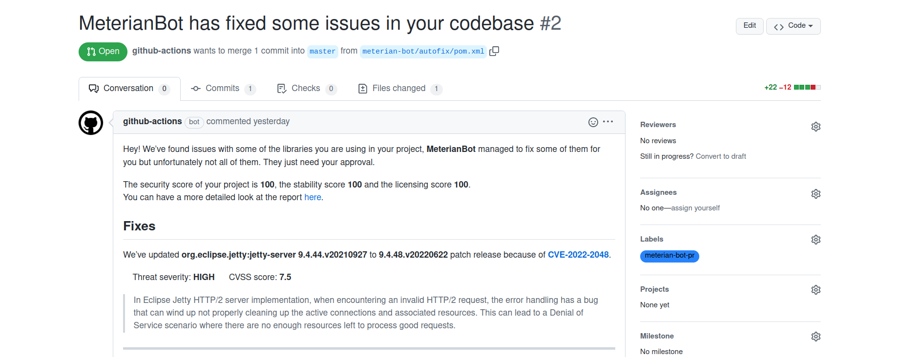

# Meterian-pr

Automatically open pull request and issues on your repository as a result of the [Meterian Client autofix](https://docs.meterian.io/the-client/command-line-parameters/advanced-options).

## Installation

Installing `meterian-pr` is fairly easy, simply download the packaged tool from the [releases page](https://github.com/MeterianHQ/meterian-pr/releases) to your machine and add it to your PATH.

```

$ wget -q -O meterian-pr_linux.tar.gz https://github.com/MeterianHQ/meterian-pr/releases/download/1.1.5/meterian-pr_linux.tar.gz
$ tar -xzf meterian-pr_linux.tar.gz -C /path/to/meterian-pr
$ export PATH=$PATH:/path/to/meterian-pr/bin

```

## Prerequisites

### SCM access tokens

As `meterian-pr` supports opening pull requests and issues on GitHub and GitLab repositories you will need export a valid access token in the respective environment variables `GITHUB_TOKEN` and `GITLAB_TOKEN`

```
$ export GITHUB_TOKEN="ghp_1B4a2e7783***"
$ export GITLAB_TOKEN="glpat-q12-Wc***"
```

### Meterian JSON report

As mentioned earlier, `meterian-pr` uses the results of the Meterian autofix to open PRs and issues. These results are expected to be in the Meterian JSON report. To generate a JSON report, scan your project as shown below

```
$ cd /path/to/project
$ meterian-docker --autofix --report-json=report.json
```
Note: the above example uses the Meterian Dockerized CLI. Learn more about it [here](https://docs.meterian.io/the-meterian-client-dockerized/basic-usage).

## Usage

Assuming that you have ran the Meterian autofix on your project and generated a JSON report containing the results, invoke `meterian-pr` to open a PR accordingly as shown below

```
$ meterian-pr /path/to/your/project PR /path/to/project/my-project/report.json my-org/my-project main

A new pull request has been opened, review it here:
https://github.com/my-org/my-project/pull/1
```

You will be linked to a new pull request authored by the user associated to the authorization token used



## Help

Here is an overview of the available commands (the help page):

```
$ meterian-pr --help
usage: meterian-pr [-h] [-v VCS] [--with-pdf-report PATH] [--commit-author-username USERNAME] [--commit-author-email EMAIL] [-l LOGLEVEL] [--version] workdir action report repository branch

positional arguments:
  workdir               The path to the work directory
  action                The action you want to perform as a result of the autofix results (i.e. PR: open a pull request on the a repository; ISSUE: open an issue on a repository)
  report                The path to the Meterian JSON report
  repository            The name of the remote repository (i.e. aws/aws-cli)
  branch                The name of the current branch (must be a branch available remotely)

optional arguments:
  -h, --help            show this help message and exit
  -v VCS, --vcs VCS     The version control system where your repository is hosted (i.e. github) (default is github) (supported: ['github', 'gitlab'])
  --with-pdf-report PATH
                        Allows to specify the path to the Meterian PDF report to add as part of the pull request if any are opened. This option is considered only if 'PR' is the action being used (view help for more details on actions)
  --commit-author-username USERNAME
                        Allows to specify a different commit author username to use (by default the Meterian bot username is used)
  --commit-author-email EMAIL
                        Allows to specify a different commit author email address to use (by default the Meterian bot email address is used)
  -l LOGLEVEL, --log LOGLEVEL
                        Sets the logging level (default is warning)
  --version             Show version and exit

```